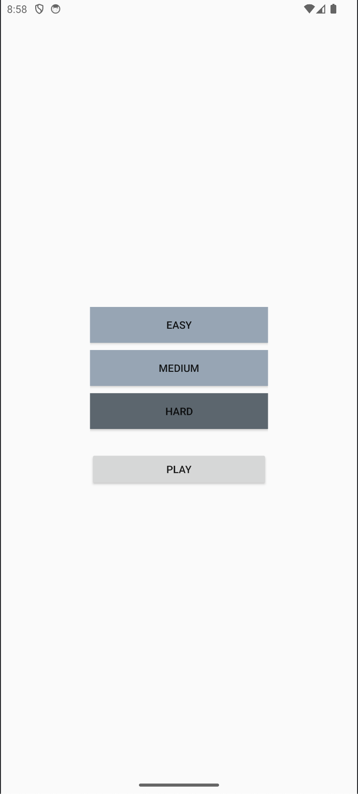
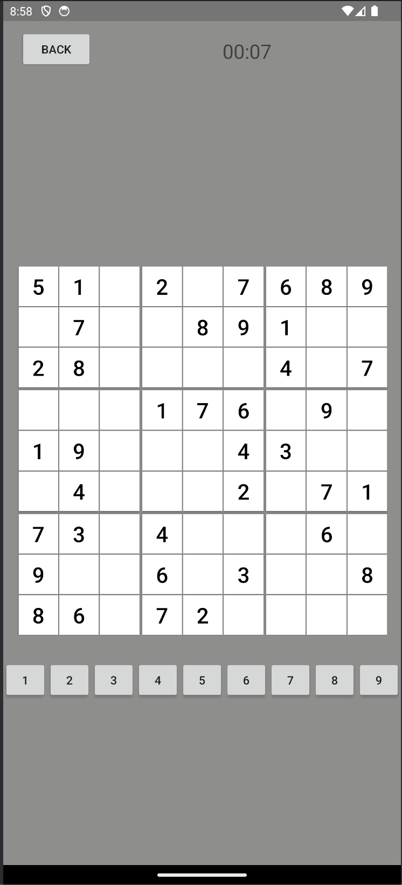
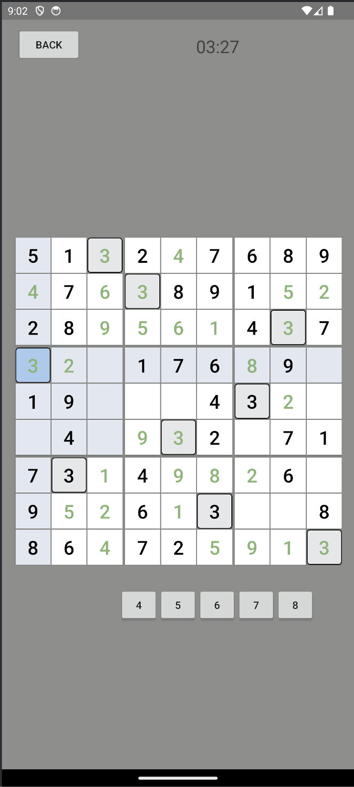
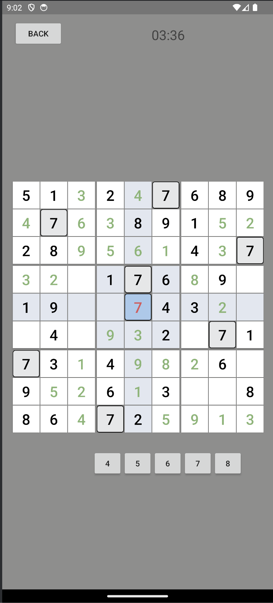

# todo

(maybe add something about debugging in cv)

# Sudoku Mobile Game
## Intro
This is a simple sudoku game I made in Java through Android Studio

## Built With
- Android Studio
- Java

## Features
- Stores count of player wins and avg. time played using built in SharedPreferences class
- Timer creates a new thread that displays and records time taken to complete a puzzle
- locks value in place if correct number is placed into a square
- When a number has been used up the player will no longer be able to place that number down
- Displays and keeps a locally stored record of the users average time and calculates new average whenever they complete a "hard" puzzle

## Getting Started
#### Installation

## Usage (screenshots and steps)

## Contact
Kirill Toptun - kirilltoptun@gmail.com